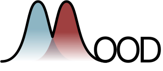
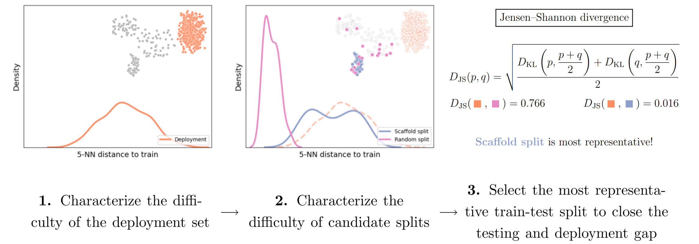

<div align="center">
    
    <h3>Molecular Out-Of-Distribution Generalization</h3>
    <p>
        Close the testing-deployment gap in molecular scoring.
    </p>
</div>

---

[](https://github.com/psf/black)
[](https://doi.org/10.1021/acs.jcim.3c01774)


Python repository with all the code that was used for the [MOOD paper](https://doi.org/10.1021/acs.jcim.3c01774).

## Setup
We recommend you to use `mamba` ([learn more](https://github.com/mamba-org/mamba)).

```shell
mamba env create -n mood -f env.yml 
conda activate mood
pip install -e . 
```

## Overview
The repository is set-up to make the results easy to reproduce. If you get stuck or like to learn more, please feel free to open an issue.

### CLI
After installation, the MOOD CLI can be used to reproduce the results.
```shell
mood --help
```

### Data
All data has been made available in a public GCP bucket. See [`gs://mood-data-public`](https://storage.googleapis.com/mood-data-public/).

### Code
- `mood/`: This is the main part of the codebase. It contains Python implementations of several reusable components and defines the CLI.
- `notebooks/`: Notebooks were used to visualize and otherwise explore the results. All plots in the paper can be reproduced through these notebooks.
- `scripts/`: Generally more messy pieces of code that were used to generate (intermediate) results.

## Use the MOOD splitting protocol
<div align="center">
    
</div>

One of the main results of the MOOD paper, is the MOOD protocol. This protocol helps to close the testing-deployment gap in molecular scoring by finding the most representative splitting method. To make it easy for others to experiment with this protocol, we made an effort to make it easy to use.

```python
import datamol as dm
import numpy as np
from sklearn.model_selection import ShuffleSplit
from mood.splitter import PerimeterSplit, MaxDissimilaritySplit, PredefinedGroupShuffleSplit, MOODSplitter

# Load your data
data = dm.data.freesolv()
smiles = data["smiles"].values
X = np.stack([dm.to_fp(dm.to_mol(smi)) for smi in smiles])
y = data["expt"].values

# Load your deployment data
X_deployment = np.random.random((100, 2048)).round()

# Set-up your candidate splitting methods
scaffolds = [dm.to_smiles(dm.to_scaffold_murcko(dm.to_mol(smi))) for smi in smiles]
candidate_splitters = {
    "Random": ShuffleSplit(n_splits=5),  # MOOD is Scikit-learn compatible!
    "Scaffold": PredefinedGroupShuffleSplit(groups=scaffolds, n_splits=5),
    "Perimeter": PerimeterSplit(n_splits=5),
    "Maximum Dissimilarity": MaxDissimilaritySplit(n_splits=5),
}

# Set-up the MOOD splitter
mood_splitter = MOODSplitter(candidate_splitters, metric="jaccard")
mood_splitter.fit(X, y, X_deployment=X_deployment)

for train, test in mood_splitter.split(X, y):
    # Work your magic!
    ...
```

## How to cite
Please cite MOOD if you use it in your research: [](https://doi.org/10.1021/acs.jcim.3c01774)

```
Real-World Molecular Out-Of-Distribution: Specification and Investigation
Prudencio Tossou, Cas Wognum, Michael Craig, Hadrien Mary, and Emmanuel Noutahi
Journal of Chemical Information and Modeling 2024 64 (3), 697-711
DOI: 10.1021/acs.jcim.3c01774
```

```bib
@article{doi:10.1021/acs.jcim.3c01774,
  author = {Tossou, Prudencio and Wognum, Cas and Craig, Michael and Mary, Hadrien and Noutahi, Emmanuel},
  title = {Real-World Molecular Out-Of-Distribution: Specification and Investigation},
  journal = {Journal of Chemical Information and Modeling},
  volume = {64},
  number = {3},
  pages = {697-711},
  year = {2024},
  doi = {10.1021/acs.jcim.3c01774},
  note = {PMID: 38300258},
  URL = {https://doi.org/10.1021/acs.jcim.3c01774},
  eprint = {https://doi.org/10.1021/acs.jcim.3c01774}
}
```

